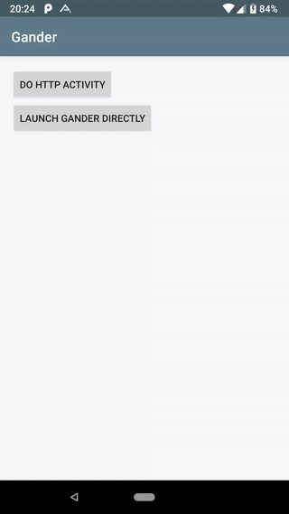
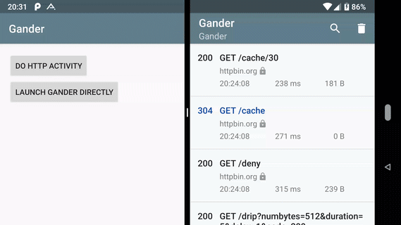

# Gander 
<p align="center">
  <a href="https://opensource.org/licenses/Apache-2.0"></a>
  <a href="https://android-arsenal.com/api?level=16"></a>
  <a href="https://travis-ci.com/Ashok-Varma/Gander"></a>
  <a href="https://androidweekly.net/issues/issue-337"></a>
</p>

<p align="center"></p>


## What is this library about?
Gander is a simple in-app HTTP inspector for Android OkHttp clients. Gander intercepts and persists all HTTP requests and responses inside your application, and provides a UI for inspecting their content.



**get sample apk from [Google Play Store][googlePlayStoreLink]**

## Features
1. Apps using Gander will display a notification showing a summary of ongoing HTTP activity. Tapping on the notification launches the full Gander UI. Apps can optionally suppress the notification, and launch the Gander UI directly from within their own interface. HTTP interactions and their contents can be exported via a share intent.
2. Search HTTP Activity and also request and response 
3. The main Gander activity is launched in its own task, allowing it to be displayed alongside the host app UI using Android 7.x multi-window support.
4. Gander Provides following variants
    - Persistence : Saves logs to disk and TTL can be controlled
    - In Memory Database : Logs will be in memory as long as the app lifecycle. 
    - No Op : This does nothing. So if users want Gander only in debug builds they can releaseCompile NoOp without dealing with variants, if(Build.DEBUG) ..etc 
 

 

Gander requires Android 4.1+ and OkHttp 3.x.

**Warning**: The data generated and stored when using this interceptor may contain sensitive information such as Authorization or Cookie headers, and the contents of request and response bodies. It is intended for use during development, and not in release builds or other production deployments.

## Setup

### Download

Based on your IDE you can import library in one of the following ways

##### Gradle:
Add the dependency in your `build.gradle` file. Add it alongside the `no-op` variant to isolate Gander from release builds as follows:
```gradle
// if persistence is needed (Uses Room to store the calls in DB)
debugImplementation 'com.ashokvarma.android:gander-persistence:3.1.0'

// if persistence is not needed (Data retained in memory lost on app close)
debugImplementation 'com.ashokvarma.android:gander-imdb:3.1.0'


releaseImplementation 'com.ashokvarma.android:gander-no-op:3.1.0'
```
If you want this in library in both release and debug builds, then try this : 
```gradle
// if persistence is needed (Uses Room to store the calls in DB)
implementation 'com.ashokvarma.android:gander-persistence:3.1.0'

// if persistence is not needed (Data retained in memory lost on app close)
implementation 'com.ashokvarma.android:gander-imdb:3.1.0'
```

<details>
  <summary>or grab via Maven:</summary>
  
      <!--if persistence is needed (Uses Room to store the calls in DB)-->
      <dependency>
        <groupId>com.ashokvarma.android</groupId>
        <artifactId>gander-persistence</artifactId>
        <version>3.1.0</version>
        <type>pom</type>
      </dependency>
      <!--if persistence is not needed (Data lost once app is dead)-->
      <dependency>
        <groupId>com.ashokvarma.android</groupId>
        <artifactId>gander-imdb</artifactId>
        <version>3.1.0</version>
        <type>pom</type>
      </dependency>
</details>

or Download the latest Gander [Persistence JAR][persistenceMavenAarDownload] / [IMDB JAR][imdbMavenAarDownload]

### Usage

##### In your application onCreate
```java
  @Override
    public void onCreate() {
        super.onCreate();
        // For Persistence (Uses Room to store the calls in DB)
        Gander.setGanderStorage(GanderPersistence.getInstance(this));
        // For In Memory DB (Data retained in memory lost on app close)
        Gander.setGanderStorage(GanderIMDB.getInstance());
    }
```

Create an instance of `GanderInterceptor` and add it as an interceptor when building your OkHttp client:

```java
OkHttpClient client = new OkHttpClient.Builder()
  .addInterceptor(new GanderInterceptor(context))
  .build();
```

That's it! Gander will now record all HTTP interactions made by this OkHttp client.

##### Show Sticky/Normal Notification
Sticky => true and Normal => false
```java
new GanderInterceptor(context).showNotification(true/false)
```

### Other Settings
##### Check stored data
Launch the Gander UI directly within your app with the intent from `Gander.getLaunchIntent()`.
```java
startActivity(Gander.getLaunchIntent(this));
```

##### Add app shortcut to your app
```java
Gander.addAppShortcut(this);
```

##### Redact Headers
You can redact headers that may contain sensitive information by calling `redactHeader()`.
```java
new GanderInterceptor(context)
    .redactHeader("Authorization")
    .redactHeader("Cookie");
```

##### Max Length
Set Response Max length to store
```java
new GanderInterceptor(context).maxContentLength(10240L)//the maximum length (in bytes)
```

##### Retention Period
Set the retention period for HTTP transaction data captured
```java
new GanderInterceptor(context).retainDataFor(Period.ONE_WEEK)
```

##### Chaining
You can chain all the method calls and pass it to OkHttp
```java
new OkHttpClient.Builder()
.addInterceptor(new GanderInterceptor(context)
                     .showNotification(false)
                     .maxContentLength(250000L)
                     .retainDataFor(GanderInterceptor.Period.FOREVER)
                     .redactHeader("Authorization"))
```

## FAQ
- Why are some of my request headers missing?
- Why are retries and redirects not being captured discretely?
- Why are my encoded request/response bodies not appearing as plain text?

Please refer to [this section of the OkHttp wiki](https://github.com/square/okhttp/wiki/Interceptors#choosing-between-application-and-network-interceptors). You can choose to use Gander as either an application or network interceptor, depending on your requirements.

##### Diff between Chuck and Gander:
1. Gander uses Room for db instead of Cupboard
2. Removed Gson Dependency
3. Improved Search
4. Improved Performance (PagedList, BackGround Load for Text, other minor pref boosts)
5. Minor fixes (Notification Channel Creation ..etc)
6. Many new features (Search highlight, app shortcut, Improved Notifications ..etc)

## Find this library useful? :heart:
Support it by joining __[stargazers](https://github.com/Ashok-Varma/Gander/stargazers)__ for this repository. :star:
    
## Other Open Source Libraries
1. [SqliteManager](https://github.com/Ashok-Varma/SqliteManager) : Sqlite Manager is a Dev Debug tool that helps to manage(Edit, Add, Clear) your android Sqlite Databases.
2. [SharedPrefManager](https://github.com/Ashok-Varma/SharedPrefManager) : SharedPref Manager is a Dev Debug tool that helps to manage(Edit, Add, Clear) your android Shared Preferences. 
3. [BottomNavigation](https://github.com/Ashok-Varma/BottomNavigation) : This Library helps users to use Bottom Navigation Bar (A new pattern from google) with ease and allows ton of customizations.

## Acknowledgements
Chuck (parent repo)
- [Chuck][chuckLink] - Copyright Jeff Gilfelt, Inc.
##### Thanks to [Jeff Gilfelt][jgilfeltLink] for his amazing library [Chuck][chuckLink]. This repo is a fork from Chuck, later on moved and released as separate project, since chuck is no longer maintained.

Awesome Icon Designer
- [Jibbie Eguna][jbeguna04Link] - He contributed the Icon to Gander.

Gander uses the following open source libraries:
- [OkHttp][okhttpLink] - Copyright Square, Inc.


License
-------

    Copyright (C) 2018 Ashok Varma.

    Licensed under the Apache License, Version 2.0 (the "License");
    you may not use this file except in compliance with the License.
    You may obtain a copy of the License at

       http://www.apache.org/licenses/LICENSE-2.0

    Unless required by applicable law or agreed to in writing, software
    distributed under the License is distributed on an "AS IS" BASIS,
    WITHOUT WARRANTIES OR CONDITIONS OF ANY KIND, either express or implied.
    See the License for the specific language governing permissions and
    limitations under the License.

[persistenceMavenAarDownload]: https://repo1.maven.org/maven2/com/ashokvarma/android/gander-persistence/3.1.0/gander-persistence-3.1.0.aar
[imdbMavenAarDownload]: https://repo1.maven.org/maven2/com/ashokvarma/android/gander-imdb/3.1.0/gander-imdb-3.1.0.aar
[googlePlayStoreLink]: https://play.google.com/store/apps/details?id=com.ashokvarma.gander.sample
[chuckLink]: https://github.com/jgilfelt/chuck
[jgilfeltLink]: https://github.com/jgilfelt
[okhttpLink]: https://github.com/square/okhttp
[jbeguna04Link]: https://github.com/jbeguna04
